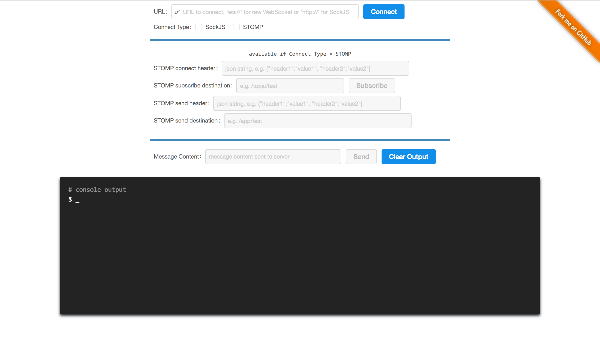

# WebSocket Debug Tool

A tool to debug websocket/sockjs/stomp.

## Features

* support WebSocket/[SockJS](https://github.com/sockjs/sockjs-client), with or without [STOMP](https://github.com/jmesnil/stomp-websocket)
* React + ES6 + webpack + [Ant Design](https://github.com/ant-design/ant-design)

## Quick Start

Open [http://jiangxy.github.io/websocket-debug-tool](http://jiangxy.github.io/websocket-debug-tool) and use directly. Pay attention to Cross-Domain Policy.

If you wanna modify the source code:

1. node 5.3+, npm 3.3+
2. `git clone` and `npm install`
3. `npm run dev` to start webpack-dev-server (with react-hot-loader)
4. open `http://localhost:4040`

## Spring-based & Netty-based server

There is a spring-based WebSocket server in the [java](java) folder for test purpose. View [Doc](java/README.md).

There is also a netty-based example server.

## Browsers support

|  Chrome |
| --------- |
| last 2 versions
